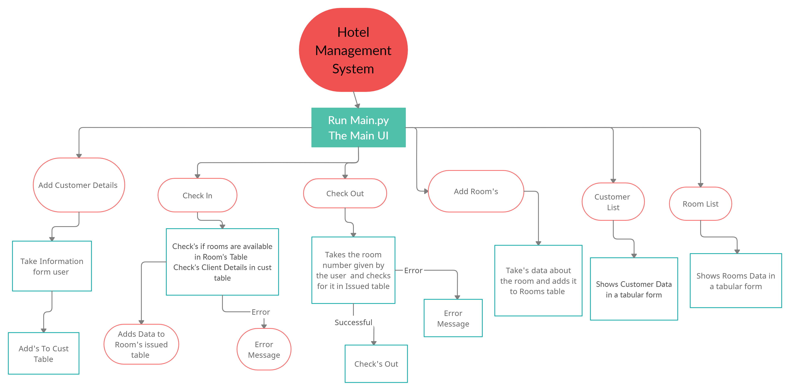
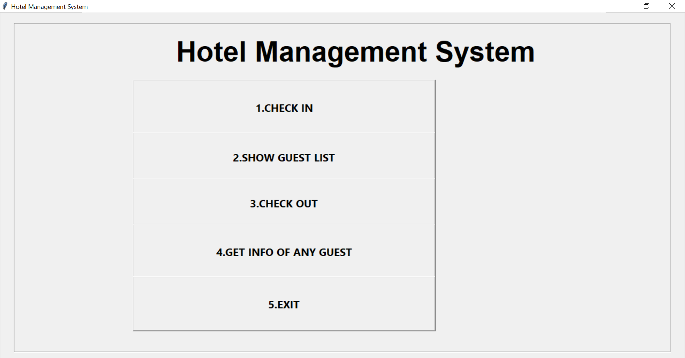
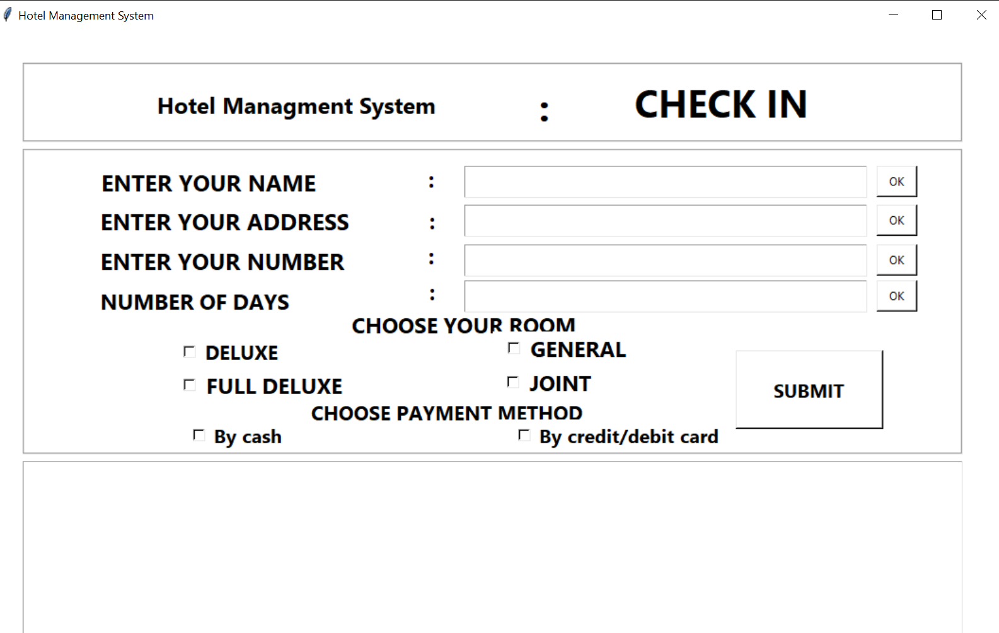
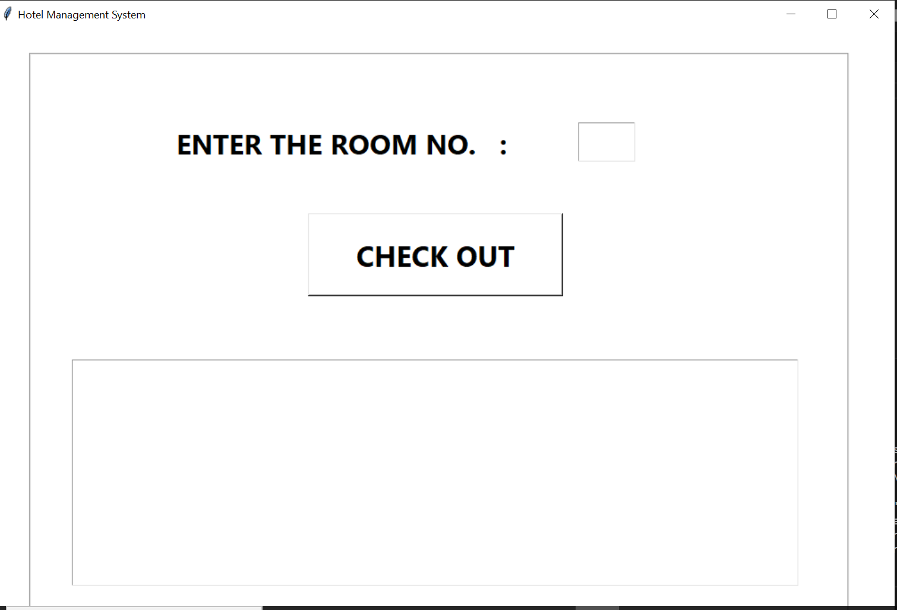
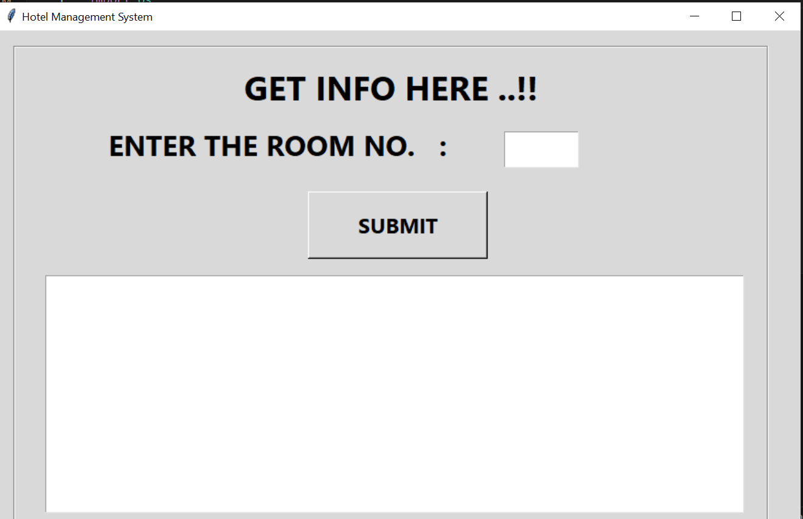
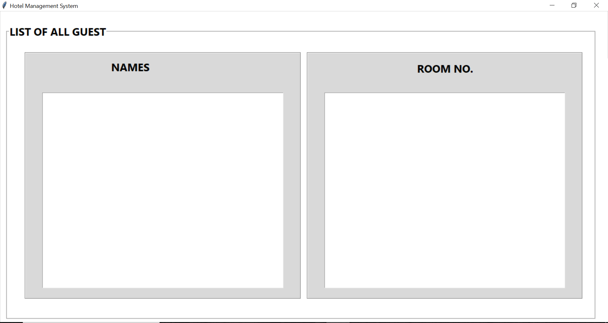

# Hotel Management system

Overview Of The Project

The objective of the project was to develop an easy to use and pocket friendly working alternative to other Hotel Management System. This desktop application uses MySQL as its backend to store, read and write to databases which stores tables which include;
1)	Cust – Table
2)	Rooms – Table 
3)	Issued_rooms – Table.
Below I have added a flow chart to summarizes how my application runs.

  

   
  

  

- ### **Index**: Organizes and manages the data efficiently for quick access.

   

- ### **Check-In**: Allows guests to register their arrival at the hotel.

   

- ### **Check-out**: Facilitates the departure process for guests, including settling bills.

   

- ### **Get Info**: Retrieves information about a specific guest or room.

   

- ### **List of All Guests**: Provides a comprehensive list of all current guests in the hotel.

   

- ### **Receipt**: Generates and issues receipts for guests, detailing their expenses during the stay.
